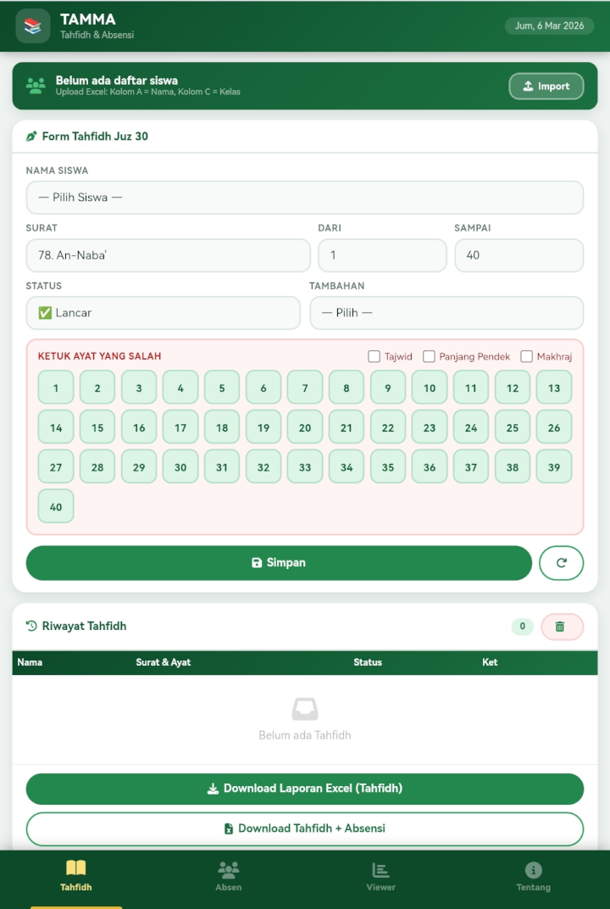
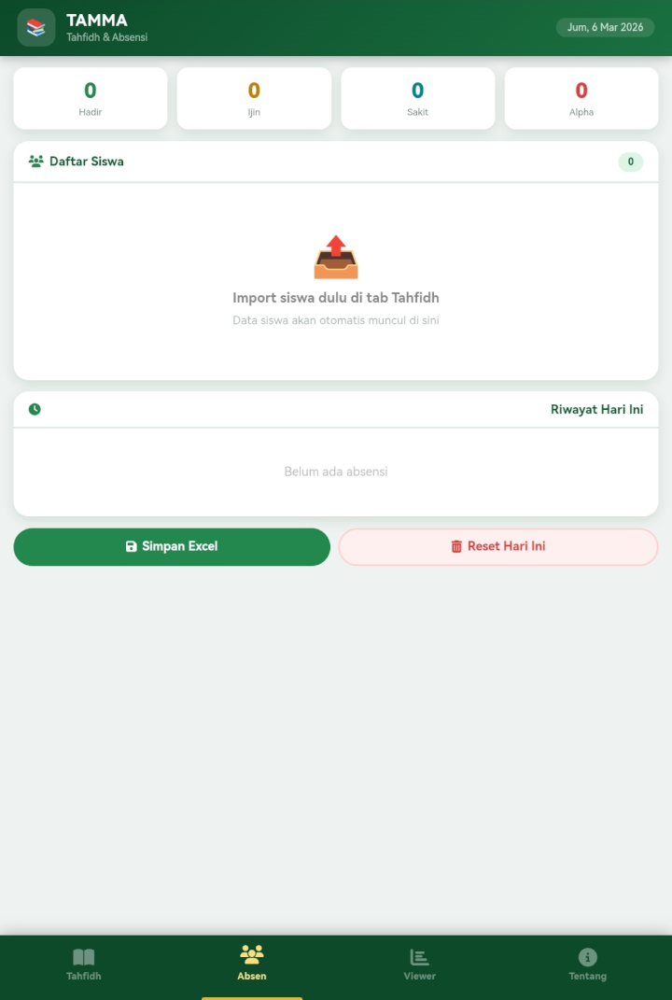
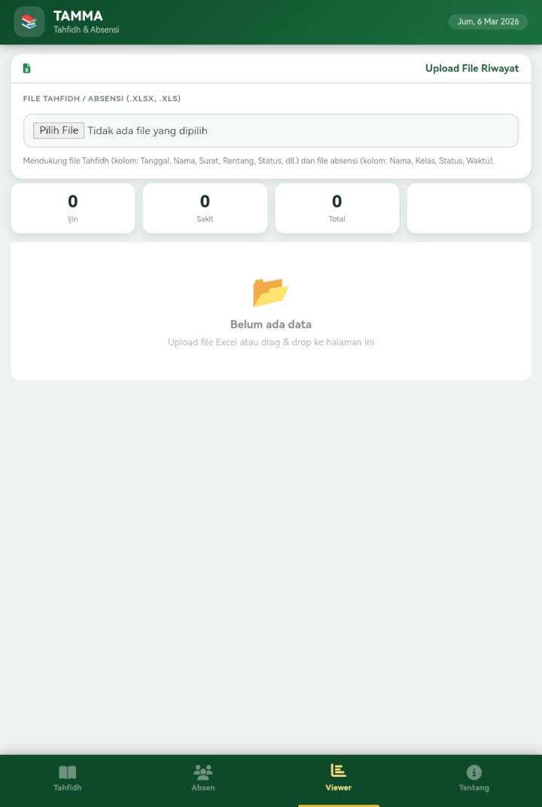
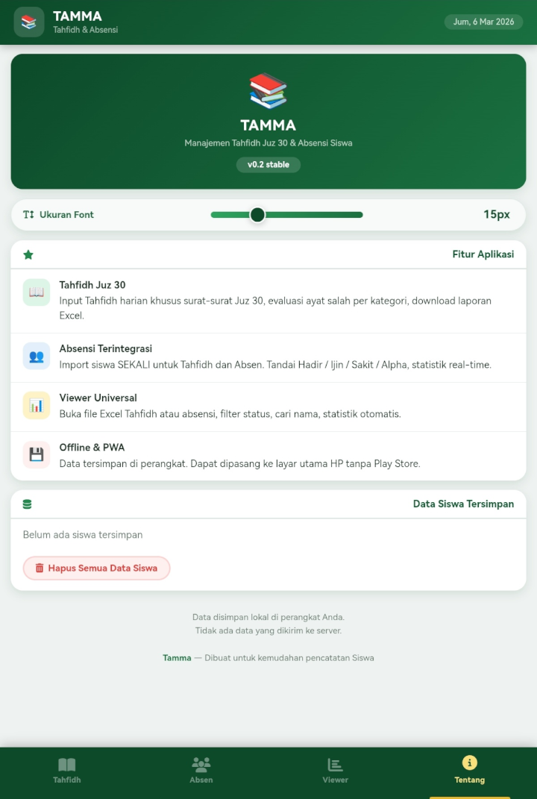

# Tamma v0.2 - Aplikasi Manajemen Tahfidh & Absensi Siswa

Aplikasi PWA untuk mencatat hafalan Juz 30 dan absensi siswa. Bisa digunakan offline, bisa diinstall ke HP.

## ✨ Fitur Utama

- 📖 **Tahfidh Juz 30** - Input hafalan harian khusus surat Juz 30
- 👥 **Absensi Terintegrasi** - Import siswa sekali untuk semua fitur
- 📊 **Viewer Universal** - Baca file Excel Tahfidh/Absensi dengan filter
- 💾 **Offline & PWA** - Data tersimpan lokal, bisa diinstall

## 🚀 Cara Install di HP

1. Buka `https://[username].github.io/tamma-app/` di Chrome/Android
2. Tap menu ⋮ → "Tambahkan ke layar utama"
3. Aplikasi akan terinstall seperti native app

## 📱 Screenshot

| Tahfidh | Absensi | Viewer | Tentang |
|---------|---------|--------|---------|
|  |  |  |  |

## 📥 Cara Penggunaan

1. **Import Data Siswa** (Tab Tahfidh)
   - Upload file Excel dengan kolom A = Nama, Kolom C = Kelas
   - Contoh format ada di folder `/examples`

2. **Input Tahfidh**
   - Pilih siswa, surat, rentang ayat
   - Tandai ayat yang salah dengan mengetuknya
   - Pilih kategori kesalahan (Tajwid, Panjang Pendek, Makhraj)
   - Simpan

3. **Absensi**
   - Tandai status siswa per hari
   - Lihat statistik realtime
   - Download laporan Excel

4. **Viewer**
   - Upload file Excel hasil download
   - Filter berdasarkan status
   - Cari nama siswa

## 🔧 Teknologi

- HTML5, CSS3, JavaScript ES6
- PWA (Service Worker + Manifest)
- SheetJS (XLSX) untuk export/import Excel
- Font Awesome 6 untuk ikon
- LocalStorage untuk penyimpanan data

## 📦 File Excel yang Didukung

- **Tahfidh**: Tanggal, Nama, Surat, Rentang Ayat, Status, Jml Salah, Ayat Salah, Kategori, Tambahan
- **Absensi**: Nama, Kelas, Status, Waktu
- Lihat contoh di folder `/examples`

## 📝 Lisensi

MIT License - Silakan gunakan dan modifikasi sesuai kebutuhan

## 👨‍💻 Developer

Dibuat untuk kemudahan pencatatan Tahfidh dan Absensi Siswa

---
**Tamma** - v0.2 stable | [Demo](https://[username].github.io/tamma-app/)
